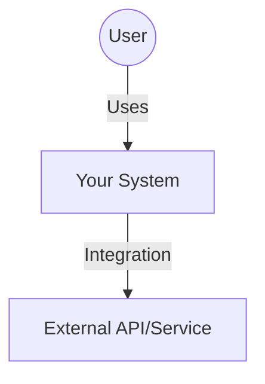
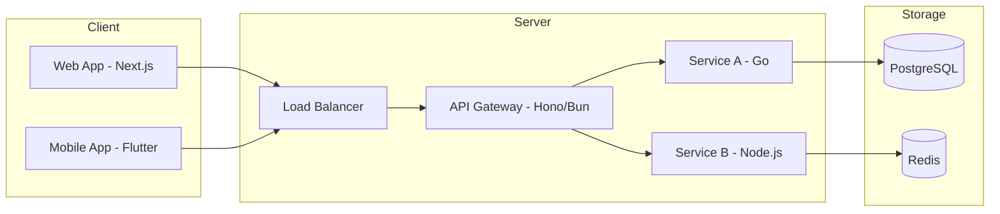
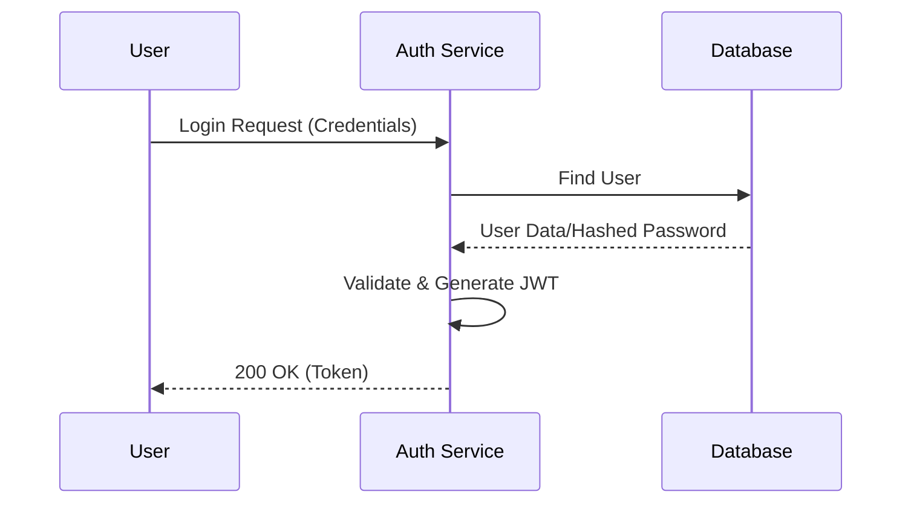
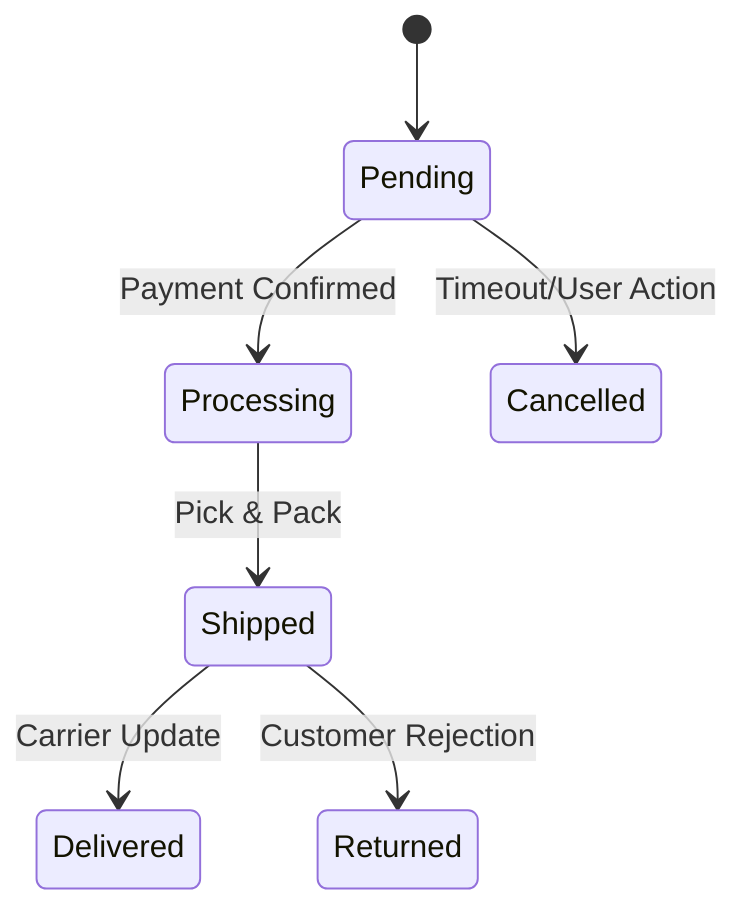

# Documentation & Visualization Standards (Mermaid.js)

Dùng file này để hướng dẫn AI vẽ sơ đồ kiến trúc hệ thống bằng Mermaid.js.

## 📐 C4 Model (Cấp độ Architecture)

### C1: System Context (Bức tranh tổng quan)

### C2: Container Diagram (Services & DBs)

## 🔄 Sequence Diagram (Luồng dữ liệu)
Dùng để mô tả flow Auth, Order, Payment...

## 🕸️ State Machine (Trạng thái đơn hàng/workflow)

## 🔴 CÁCH VẼ ĐÚNG (Guidelines)
- **Top-Down:** Ưu tiên vẽ từ trên xuống dưới cho kiến trúc.
- **Left-Right:** Ưu tiên vẽ từ trái sang phải cho data flow.
- **Annotations:** Luôn thêm chú thích về công nghệ (ví dụ: `[PostgreSQL]`, `[gRPC]`) vào các node.
- **Simplicity:** Không vẽ quá 15-20 nodes trong một sơ đồ. Nếu quá phức tạp, hãy tách nhỏ.
