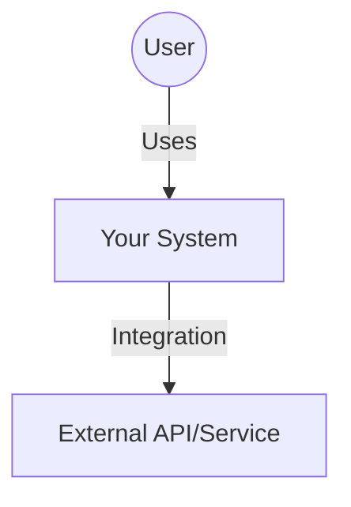
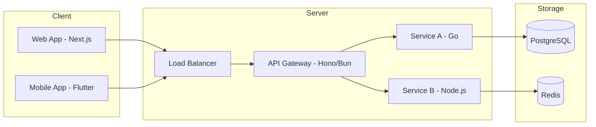
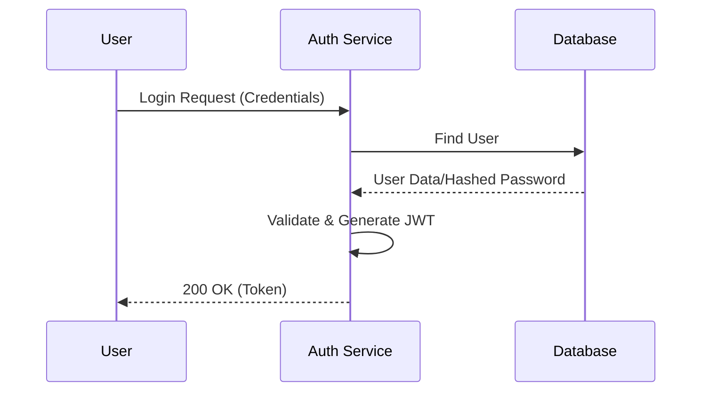
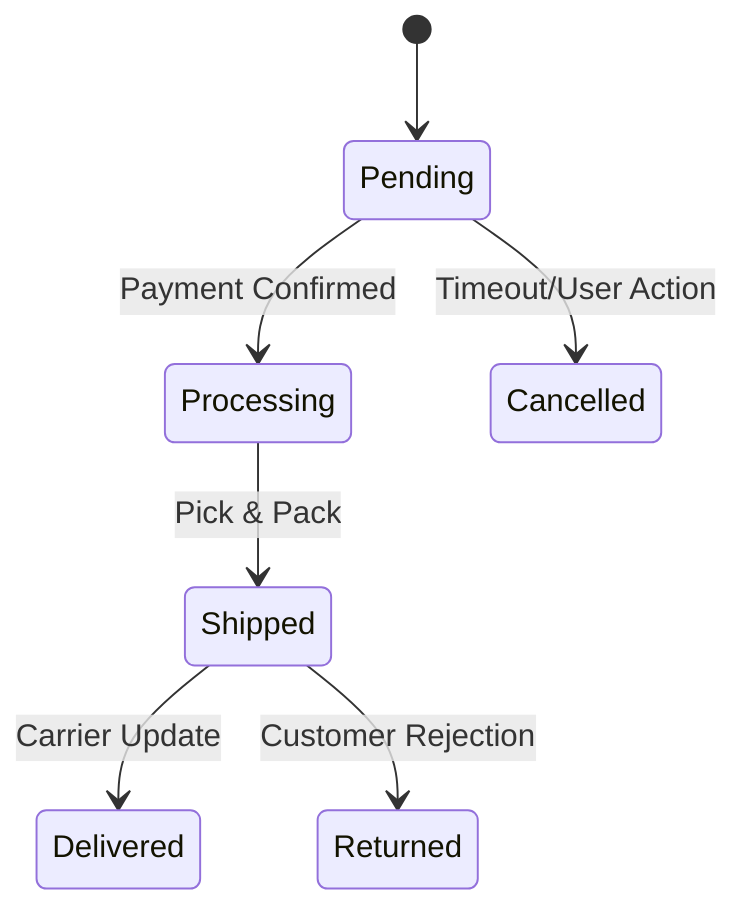

# Documentation & Visualization Standards (Mermaid.js)

Use this file to guide the AI in drawing system architecture diagrams using Mermaid.js.

## 📐 C4 Model (Architecture Level)

### C1: System Context (Overview)

### C2: Container Diagram (Services & DBs)

## 🔄 Sequence Diagram (Data Flow)
Used to describe flows for Auth, Orders, Payments, etc.

## 🕸️ State Machine (Order Status/Workflow)

## 🔴 Drawing Guidelines
- **Top-Down:** Preferred for overall architecture.
- **Left-Right:** Preferred for data flow.
- **Annotations:** Always add technology notes (e.g., `[PostgreSQL]`, `[gRPC]`) to the nodes.
- **Simplicity:** Do not exceed 15-20 nodes per diagram. If too complex, split them into smaller diagrams.
